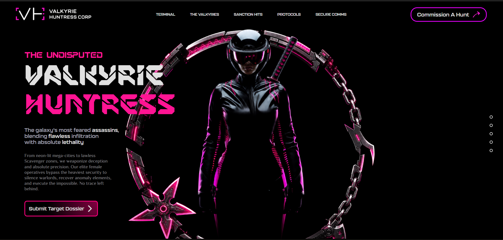
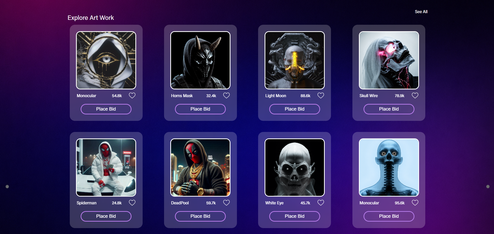

# Silent Congregation | Sheryians Cohort 3.0

#### ☠️☠️The Cryptic Syndicate’s Silent Congregation☠️☠️

The **Cryptic Syndicate** deals exclusively in the forbidden 💀. Secure your digital ledgers, for nothing under a **million dollars** passes through the veil **tonight**.

Welcome to my design assignment for the  **Sheryians Coding School Cohort 3.0**

# 🎞️ Sneak Peek

[New addition Ass-3-Hard | Valkyrie Huntress Corp](https://yashrajsinghmeel.github.io/Cohort3-A3/Ass_3_hard/)

[Live link | Silent Congregation](https://yashrajsinghmeel.github.io/Cohort3-A3/)

# ☠️ A Note for the Reviewer

This project was built to master the fundamentals of  **modern CSS layout and UI/UX design** .The website exudes a **mysterious, high-end digital gallery** atmosphere. It leans heavily into a "dark-mode" aesthetic that feels both underground and premium.

# 🎨Evolution of the Build (Tech Stack)

To bring this project to life, I used:

* **HTML5:** The skeletal structure of our Congregation.
* **CSS3:** Glassmorphism & Cyber-Noir Palette (styling, flexbox, and grid).
* **GitHub Pages:** To make the project live for you all  to see.

# 🌑Assignment Context

* **School:** Sheryians Coding School
* **Program:** Cohort 3.0 ( Assignment-3 )
* **Objective:** UI/UX Recreation & CSS Mastery

# Made with ⚡ and 💛 by [ Yashraj Singh Meel ]
